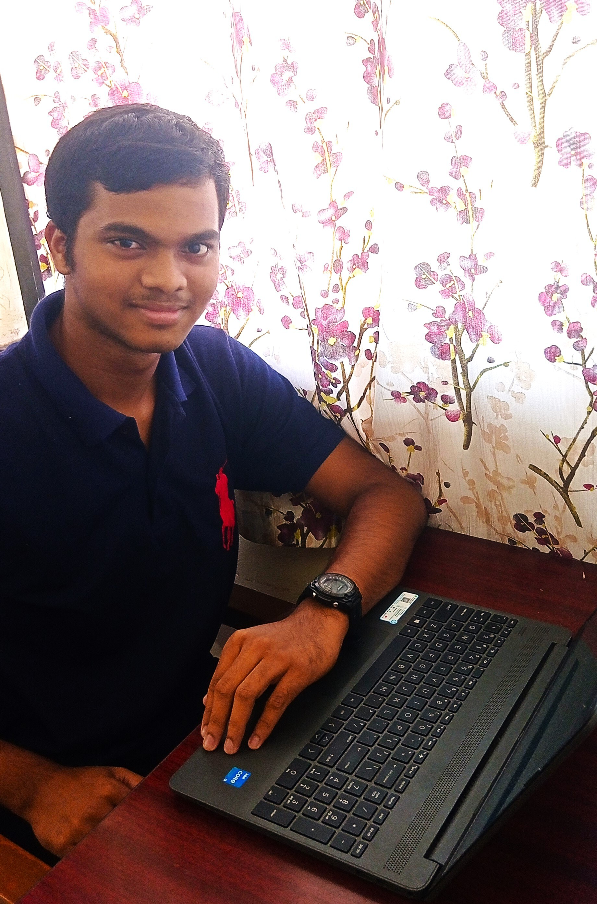

  
# My Profile
  

___

### About me

**Name:** Joywin Colaco
 

  

  

**Description:**
 
I live in the small state of Goa, aspire to contribute to the current world development and avoid wasting my talents by not doing anything.

___

### Education

| **Academic Year** | **Standard**   | **School Name**                       |
| :---------------: | :------------: | :-----------------------------------: |
| 2010-2020         | 1-10           | Regina Mundi High School              |
| 2020-2022         | 11-12          | St. Andrews Higher Secondary School   |
| _2022-Present_    | _1st year_     | _Indian Institute of Technology, Goa_ |

___

### Courses @ IIT Goa

**Spring Semester**
+ __CS102__ Software Tools _Dr. Clint George_
+ __MA102__ Basic Linear Algebra _Dr. Kalpesh Haria_
+ __MA103__ Ordinary Differential Equations _Dr. Saumya Bajpai_
+ __PH102__ Electricity and Magnetism _Dr. Vaibhav Wasnik , Dr. Santosh Kumar_
+ __PH103__ Physics Lab  _Dr. Vaibhav Wasnik , Dr. Santosh Kumar_
+ __BIO101__ Introductory Biology _Dr. Sreenath Balakrishnan_
+ __ME102__ Engineering Graphics and Introduction to Computer-Aided-Drawing _Dr. Arindam Das_
+ __EE101__ Introduction to Electrical and Electronics Engineering _Dr. Apeksha Madhukar , Dr. Bidhan Pramanick _
+ __NO102__ National Sports Organization _Mr. Santosh Upadyhay_
+ __ELPP__ English Language Proficiency Programme _Ms. Neeraja Raghavan_

___

### Hobbies and Interests

#### Hobbies
  
+ Musician
+ Footballer
+ Sports Analyst (Football)
  
#### Interests

+ Pure Mathematics (Number Theory)
+ Quantum Physics

